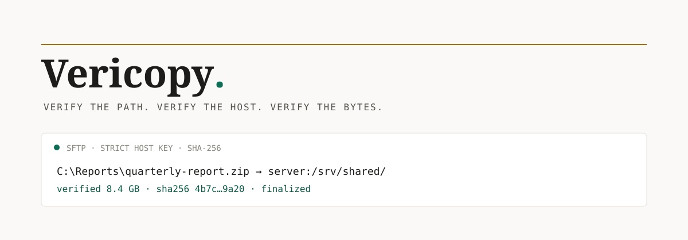

# Vericopy

Desktop-first, cross-platform file transfer over SSH with strict host
verification, SHA-256 validation, Windows path normalization, and documented
destination permissions.

> Project status: `0.1.0-dev`. The verified transfer engine is implemented and
> the desktop application is now the primary product surface. See the
> [living project tracker](docs/project-status.md) for exact status and next work.

Vericopy is a native desktop application backed by a Go transfer engine. Its
CLI remains available for automation and expert workflows. The desktop app does
not require a hosted service: transfers run from the user's machine, use the
local SSH agent or explicitly selected key, and retain strict `known_hosts`
verification. The desktop app can also use a one-time SSH password without
adding it to saved sessions, history, or logs.

## Desktop application

The in-progress desktop surface is a focused transfer workspace: choose a local
file or folder, review a remote destination and security policy, then transfer
and verify without composing an SSH command by hand. It is built with Wails and
shares the exact same Go transfer engine as the CLI; it is not a separate or
less-secure implementation.

The initial desktop workflow includes source inspection, destination validation,
strict host-key prerequisites, transfer review, verified SFTP execution, and a
clear result state. It also has local saved sessions, truthful per-file byte
progress, and redacted local transfer history. Sessions persist complete form
state, including source and identity-key paths, but never passwords or key
contents. A built-in Help view explains connection setup, authentication, host
identity, and the verified-transfer sequence. Its task-first editorial interface
uses bundled offline fonts for consistent rendering across platforms. Native acceptance
and signed packaging remain release gates; see the [desktop UI plan](docs/desktop-ui.md)
and [desktop acceptance checklist](docs/desktop-acceptance.md).

## Why Vericopy

- Resumes compatible partial uploads instead of restarting large files.
- Reads the remote bytes back through SFTP and compares size plus SHA-256 before
  finalization.
- Rejects unknown and changed SSH host keys by default.
- Distinguishes Windows drive paths from `user@host:path` destinations.
- Understands native Windows, UNC, Git Bash/MINGW, Cygwin, and POSIX path forms.
- Applies explicit POSIX destination permissions instead of copying synthetic
  Windows or Cygwin mode bits.
- Checks whether a service account can traverse and read the final destination.
- Never accepts a password in process arguments, never persists a desktop
  password, and sends no telemetry.

## Short demonstration

```console
$ vericopy inspect-path 'C:\Users\me\Documents\quarterly-report.zip' --target-os windows
kind: windows-drive
normalized: C:\Users\me\Documents\quarterly-report.zip
target OS: windows

$ vericopy copy 'C:\Users\me\Documents\quarterly-report.zip' \
    transfer@files.example:/srv/shared/quarterly-report.zip \
    --resume --permissions shared --readable-by document-indexer
Transferred 1 file(s), 42890211 bytes to /srv/shared/quarterly-report.zip
SHA-256: 4b7c...9a20
```

## Install the CLI from source

Requirements: Go 1.25 or later. The project is developed against the current
stable Go toolchain.

```sh
git clone https://github.com/bashatahamal/vericopy.git
cd vericopy
go build -trimpath -o ./bin/vericopy ./cmd/vericopy
```

CLI archives will be available for Windows, macOS, and Linux on amd64 and arm64
after the first tagged release. Native desktop packages require separate
per-platform acceptance and signing before publication; see
[release verification](docs/release-verification.md).

### Build the desktop development binary

The desktop shell uses checked-in, embedded frontend assets. On a supported
desktop platform, build it with:

```sh
make desktop-build
./bin/vericopy-desktop
```

The UI requires a native desktop session. It does not start a web server or
send files through a hosted intermediary.

To produce a native Wails package on its target operating system, install the
matching Wails CLI and run `make desktop-package`:

```sh
go install github.com/wailsapp/wails/v2/cmd/wails@v2.13.0
make desktop-package
```

This is intentionally not treated as a cross-build: package, signing, and
acceptance evidence must be produced on the platform that will run the app.

When building a Linux desktop package under WSL, use a separate checkout in the
Linux filesystem, such as `~/src/vericopy`. Do not build it from the mounted
`/mnt/c/...` checkout that also produces Windows packages: a running Windows
executable is locked and prevents WSL from cleaning the shared `build/bin`
directory.

## CLI quick start

1. Load a private key into your SSH agent.
2. Add the server host key to `~/.ssh/known_hosts` only after verifying its
   fingerprint through a trusted channel.
3. Inspect an unfamiliar source path.
4. Run a dry run, then copy.

```sh
ssh-add ~/.ssh/id_ed25519
vericopy doctor
vericopy inspect-path '/home/me/Documents/annual-report.pdf'
vericopy copy '/home/me/Documents/annual-report.pdf' \
  'transfer@server.example:/srv/shared/annual-report.pdf' \
  --resume --dry-run
vericopy copy '/home/me/Documents/annual-report.pdf' \
  'transfer@server.example:/srv/shared/annual-report.pdf' \
  --resume --permissions shared
```

Vericopy never trusts a host automatically. `ssh-keyscan` retrieves a key but
does not authenticate it; compare its fingerprint through an independent,
trusted channel before adding it to `known_hosts`.

## Commands

```text
vericopy copy SOURCE DESTINATION
vericopy verify SOURCE DESTINATION
vericopy doctor
vericopy inspect-path PATH
vericopy check-access DESTINATION --as-user USER
vericopy version
```

Run `vericopy COMMAND --help` for all flags. Common connection flags are
`--identity`, `--port`, and `--known-hosts`. Output flags are `--json`, `--quiet`,
and `--no-color`.

## Common workflows

### Resume and verify one large file

```sh
vericopy copy ./archive.tar.zst user@host:/srv/archive.tar.zst --resume
```

Vericopy writes a restrictive hidden partial file plus non-secret compatibility
metadata. It checks size, modification time, and source/partial prefix bytes
before appending. It reads the finished partial file back through SFTP, compares
size and SHA-256, applies policy, and renames it. Finalization is best-effort
atomic because the remote filesystem and SFTP server determine rename behavior.

### Copy a directory

```sh
vericopy copy ./photos user@host:/srv/photos --recursive --resume
```

Symlinks and special files are rejected. An existing destination is rejected
unless `--overwrite` is explicit.

### Verify an existing destination

```sh
vericopy verify ./archive.tar.zst user@host:/srv/archive.tar.zst
```

### Check service-account access

```sh
vericopy check-access user@host:/srv/shared/annual-report.pdf --as-user document-indexer
```

The check reads numeric user/group information and SFTP metadata. It does not
invoke `sudo`, change groups, run recursive `chmod`, or modify the server.

## Windows examples

PowerShell:

```powershell
vericopy.exe copy `
  'C:\Users\me\Documents\quarterly-report.zip' `
  'transfer@server:/srv/shared/quarterly-report.zip' `
  --resume --permissions shared
```

Git Bash:

```sh
vericopy.exe copy \
  '/c/Users/me/Documents/quarterly-report.zip' \
  'transfer@server:/srv/shared/quarterly-report.zip' \
  --resume --permissions shared
```

The native SFTP backend normalizes the local path internally. The optional
rsync backend treats path dialect as a property of the selected rsync binary,
not the launching shell. See the
[Cygwin and MINGW debugging guide](docs/debugging/windows-cygwin-rsync-paths.md).

## Permission presets

| Policy | Directories | Files | Intended use |
| --- | ---: | ---: | --- |
| `private` | `0700` | `0600` | SSH account only |
| `shared` | `2770` | `0660` | Read/write group collaboration |
| `service-readonly` | `2750` | `0640` | Owner writes, a designated read-only group reads |
| `public-readonly` | `0755` | `0644` | World-readable published content |
| `preserve` | source mode | source mode | Explicit POSIX-to-POSIX preservation |

`--file-mode` and `--directory-mode` override a preset after octal validation.
`--group NAME` resolves a remote group and applies it without privilege
escalation. Windows ACL replication is outside the initial scope.

## JSON and exit codes

```sh
vericopy inspect-path '/cygdrive/c/Users/me/Documents/annual-report.pdf' --target-os windows --json
```

Success:

```json
{"ok":true,"result":{"original":"/cygdrive/c/Users/me/Documents/annual-report.pdf","kind":"cygwin","normalized":"C:\\Users\\me\\Documents\\annual-report.pdf","target_os":"windows","absolute":true}}
```

Failure:

```json
{"ok":false,"error":{"code":"HOST_KEY_REJECTED","message":"the SSH server host key is unknown or does not match known_hosts","hint":"Verify the server fingerprint independently. Never bypass this check."}}
```

| Exit | Meaning |
| ---: | --- |
| `0` | Success |
| `2` | Invalid input, path, mode, or dialect |
| `3` | Host identity or authentication failure |
| `4` | Connection or transfer failure |
| `5` | Integrity, resume, or verification failure |
| `6` | Group or service-account access failure |
| `10` | Unexpected internal failure |

## Platform behavior

| Source form | Windows build | macOS/Linux build |
| --- | --- | --- |
| `C:\Users\...` | Normalized and opened | Classified, but not opened |
| `\\server\share\...` | Supported where Go can open the share | Classified, but not opened |
| `/c/Users/...` | Converted to a Windows drive path | Classified, but not opened |
| `/cygdrive/c/Users/...` | Converted to a Windows drive path | Classified, but not opened |
| `/home/user/...` | Requires a Windows drive mapping | Opened as POSIX |

Read the full [platform compatibility contract](docs/platform-behavior.md).

## Security and architecture

- [Security model](docs/security-model.md)
- [Architecture and transfer sequence](docs/architecture.md)
- [Linux service permission guide](docs/guides/linux-service-permissions.md)
- [Brand and accessibility decisions](docs/brand.md)
- [Desktop acceptance checklist](docs/desktop-acceptance.md)

SHA-256 proves that the destination bytes match the source bytes Vericopy
observed. It does not prove that the source is trustworthy, safe, or malware-free.

## Development

```sh
go test ./...
go test -race ./...
go vet ./...
go run honnef.co/go/tools/cmd/staticcheck@v0.7.0 ./...
go run golang.org/x/vuln/cmd/govulncheck@v1.6.0 ./...
make cross-build
sh ./integration/run.sh   # requires Docker and OpenSSH client tools
CONTAINER_RUNTIME=podman VERICOPY_GO_BIN=/path/to/go ./integration/run.sh
CONTAINER_RUNTIME=podman ./scripts/race-container.sh
```

`Makefile` accepts `GO=/path/to/go`, `COMMIT=...`, and `BUILD_DATE=...`.
Set `BUILD_DATE` from `SOURCE_DATE_EPOCH` in reproducible release environments;
ordinary local builds use `unknown` rather than embedding the current time.

## Limitations and non-goals

- Exact Windows ACL translation is not attempted.
- Symlink following is not implemented.
- Password authentication is not accepted through arguments.
- The optional rsync adapter currently supports regular files only. It performs
  native SFTP-based SHA-256 confirmation after rsync completes.
- Rename finalization cannot be more atomic than the remote filesystem permits.
- Service-user checks model POSIX mode bits and group membership, not every ACL,
  MAC, mount, namespace, or application sandbox policy.

## Project origin

The project began with a practical Windows interoperability failure: Git Bash
presented a source as `/c/...`, while a Cygwin-built rsync executable expected
its own configured path dialect, commonly `/cygdrive/c/...`. The launching
shell did not determine the binary's path model. Vericopy makes that boundary
visible and avoids it entirely in the default native SFTP backend.

## License

MIT. See [LICENSE](LICENSE).
