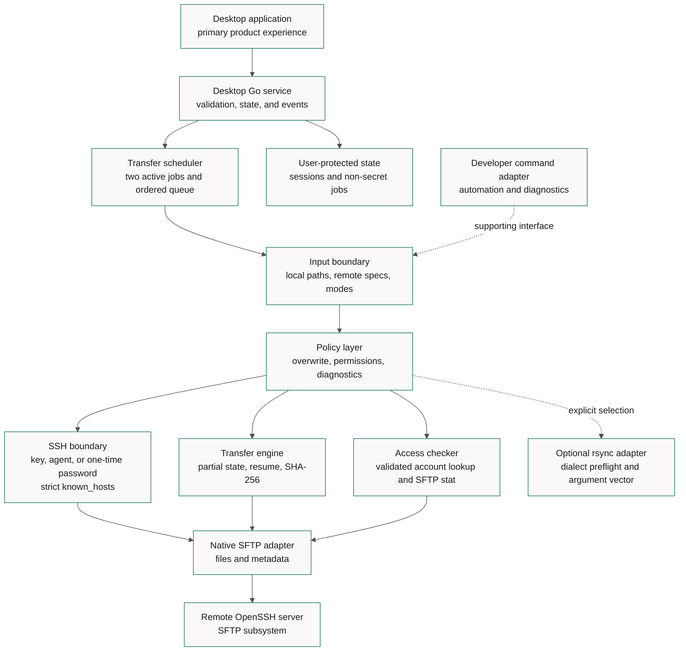
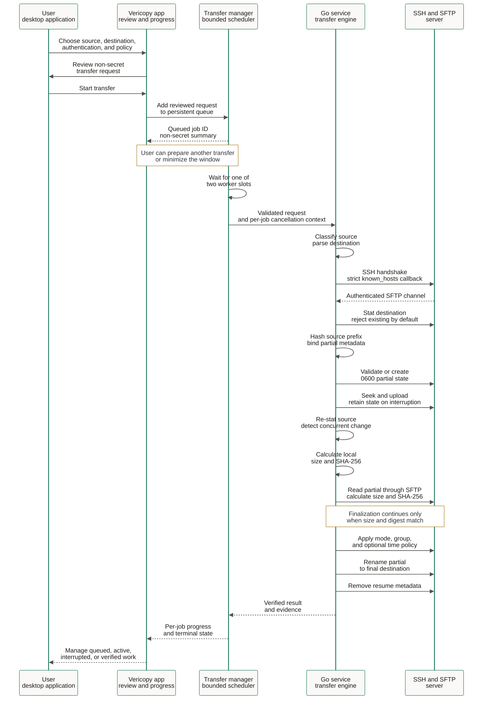

# Architecture

Vericopy is a native desktop application with a local Go service and transfer
engine. It separates presentation, persistence, validation, security policy,
transport, and transfer state. Security-sensitive boundaries accept injected
interfaces so tests can exercise rejection and failure paths without a
production server.

The command adapter is retained for engineering automation and diagnostics. It
reuses the same engine but is not a parallel product surface.

## Components



## Native transfer sequence



## Package responsibilities

| Package | Responsibility |
| --- | --- |
| `internal/desktop` | Desktop validation, state, progress, cancellation, and transfer orchestration |
| `cmd/vericopy-desktop` | Native Wails application entry point and bindings |
| `internal/app` | Supporting command adapter, flags, and automation output |
| `internal/localpath` | Path dialect classification and runtime normalization |
| `internal/remote` | Safe `[user@]host:path` parsing and traversal rejection |
| `internal/sshclient` | Authentication and strict host-key verification |
| `internal/backend/sftp` | Native SFTP filesystem adapter |
| `internal/transfer` | Copy, resume, verification, policy, and finalization |
| `internal/permissions` | Presets, octal validation, and formatting |
| `internal/access` | Remote user/group lookup and POSIX read/traverse checks |
| `internal/backend/rsync` | Optional executable classification and safe arguments |
| `internal/verrors` | Stable diagnostic codes and exit categories |
| `internal/output` | Stable JSON envelope and concise human rendering |

## Partial state

For destination `quarterly-report.zip`, Vericopy creates a hidden name resembling:

```text
.quarterly-report.zip.vericopy-f6247a91b18dbe31.partial
.quarterly-report.zip.vericopy-f6247a91b18dbe31.partial.json
```

The suffix binds the destination, source size, and source prefix digest. The
sidecar records a schema version, source size, modification time, prefix length,
and prefix SHA-256. It does not record a local path, credential, or host secret.

Before resume, Vericopy checks the metadata, ensures the partial is not larger
than the source, and compares the partial bytes available within the validation
prefix with the same local bytes. This detects accidental reuse of unrelated
state. It cannot prove that matching bytes beyond the validated prefix are
unchanged until the final whole-file SHA-256 readback. Finalization never occurs
before that whole-file comparison.

## Finalization and concurrency

The default is no overwrite. Vericopy stats the destination before work and the
SFTP server processes the final rename. Filesystem rename semantics vary, so the
operation is described as best-effort atomic. When the user explicitly enables
overwrite, an existing file is removed immediately before rename because
portable SFTP replacement semantics differ across servers. That creates a short
replacement window and is why overwrite must be explicit.

## Cancellation

The desktop cancellation control and process termination signals cancel the
active Go context. Source reads observe that context. Ordinary interruption
retains compatible partial state and its restrictive metadata so a later
transfer can resume safely when resume is enabled.

## Queue and restart recovery

The desktop service owns an in-process scheduler with two worker slots. A job is
persisted before dispatch, then moves through queued, running, and terminal
states. Byte progress is held in memory and emitted with the job ID; lifecycle
state is written atomically so a crash does not turn an uncertain job into a
verified result.

The persisted request shape has no password field. A queued password can exist
only in its in-memory runtime job until the SSH handshake starts. When the
process exits, queued and running key/agent jobs recover as paused, while
password-authenticated jobs recover as needs-password. The scheduler never
automatically reconnects restored work.
