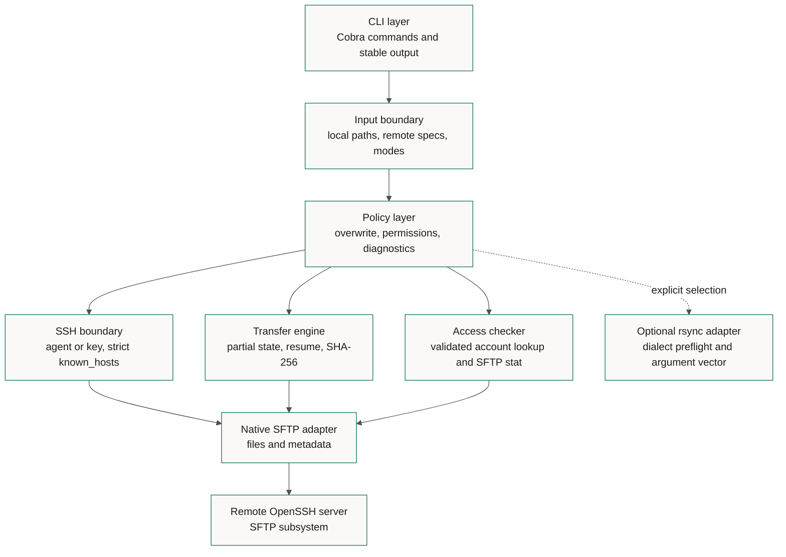
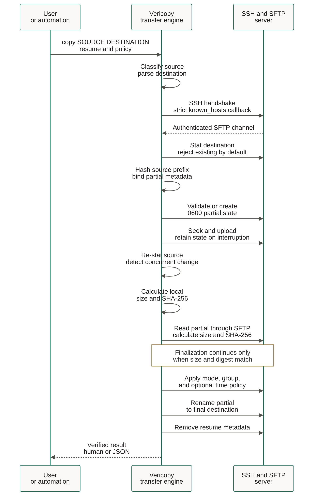

# Architecture

Vericopy separates parsing, security policy, transport, transfer state, and
presentation. Security-sensitive boundaries accept injected interfaces so tests
can exercise rejection and failure paths without a production server.

## Components



## Native transfer sequence



## Package responsibilities

| Package | Responsibility |
| --- | --- |
| `internal/app` | Commands, flags, dependency assembly, output selection |
| `internal/localpath` | Path dialect classification and runtime normalization |
| `internal/remote` | Safe `[user@]host:path` parsing and traversal rejection |
| `internal/sshclient` | Authentication and strict host-key verification |
| `internal/backend/sftp` | Native SFTP filesystem adapter |
| `internal/transfer` | Copy, resume, verification, policy, and finalization |
| `internal/permissions` | Presets, octal validation, and formatting |
| `internal/access` | Remote user/group lookup and POSIX read/traverse checks |
| `internal/backend/rsync` | Optional executable classification and safe arguments |
| `internal/verrors` | Stable diagnostic codes and exit categories |
| `internal/output` | Stable JSON envelope and concise human rendering |

## Partial state

For destination `movie.mkv`, Vericopy creates a hidden name resembling:

```text
.movie.mkv.vericopy-f6247a91b18dbe31.partial
.movie.mkv.vericopy-f6247a91b18dbe31.partial.json
```

The suffix binds the destination, source size, and source prefix digest. The
sidecar records a schema version, source size, modification time, prefix length,
and prefix SHA-256. It does not record a local path, credential, or host secret.

Before resume, Vericopy checks the metadata, ensures the partial is not larger
than the source, and compares the partial bytes available within the validation
prefix with the same local bytes. This detects accidental reuse of unrelated
state. It cannot prove that matching bytes beyond the validated prefix are
unchanged until the final whole-file SHA-256 readback. Finalization never occurs
before that whole-file comparison.

## Finalization and concurrency

The default is no overwrite. Vericopy stats the destination before work and the
SFTP server processes the final rename. Filesystem rename semantics vary, so the
operation is described as best-effort atomic. With `--overwrite`, an existing
file is removed immediately before rename because portable SFTP replacement
semantics differ across servers. That creates a short replacement window and is
why overwrite must be explicit.

## Cancellation

The process derives a context from `SIGINT` and `SIGTERM`. Source reads observe
that context. Ordinary interruption retains compatible partial state and its
restrictive metadata so `--resume` can continue safely.

